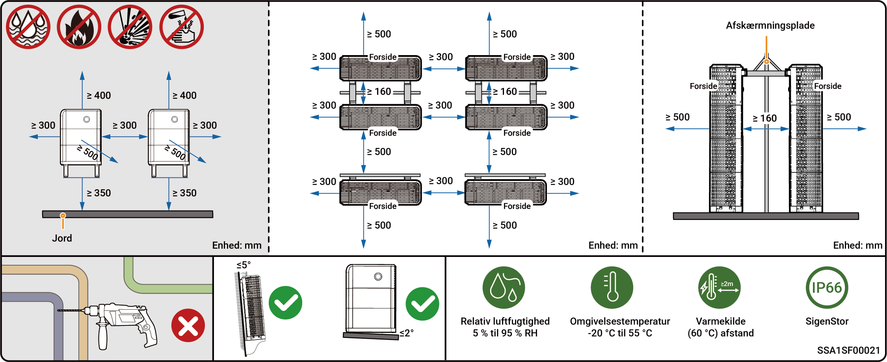
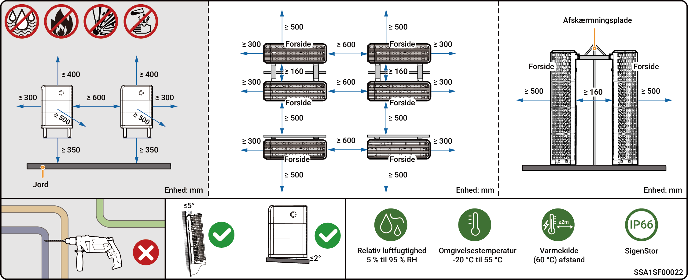

# Krav til valg af installationssted



* <mark style="color:blue;">Før installation af udstyret bedes du sørge for at læse følgende installationskrav omhyggeligt. Virksomheden er ikke ansvarlig for funktionsfejl eller skader, som opstår som følge af udstyrets drift, hvis installationskravene ikke overholdes, selv i tilfælde, der medfører personskade.</mark>
* <mark style="color:blue;">Under den faktiske installation skal valget af installationssted overholde lokale bestemmelser, brandbekæmpelsesbestemmelser og andre relevante love. Den specifikke planlægning af installationsstedet skal være underlagt installatøren eller ingeniør-, købs- og konstruktionskontrakterne (EPC).</mark>

### **Installationsmiljøkrav**

* Installer ikke udstyret i et røgfyldt, brandfarligt eller eksplosivt miljø.
* Undgå at udsætte udstyret for direkte sollys, regn, stillestående vand, sne eller støv. Det anbefales at installere udstyret på et beskyttet sted. Træf forebyggende foranstaltninger i betjeningsområder, der er udsat for naturkatastrofer som oversvømmelser, jordskred, jordskælv og tyfoner.
* Installer ikke udstyret i et miljø med kraftig elektromagnetisk interferens.
* Temperaturen og luftfugtigheden i installationsmiljøet skal leve op til udstyrets krav.
* Udstyret skal installeres i et område, der er mindst 500 m væk fra korrosionskilder, som kan forårsage saltskader eller syreskader. Korrosionskilder omfatter, men er ikke begrænset til, kystområder, termiske kraftværker, kemiske anlæg, smelteværker, kulkraftværker, gummifabrikker og galvaniseringsanlæg.
* I områder med gode marine forhold (f.eks. Norge, hvor saltholdigheden tæt på kysten er ≤ 28 psu), kan monteringsafstanden for enheden fra kystlinjen passende lempes til ≥ 200 m.
* Hvis enhedens udvendige overflade er beskadiget, skal enheden males snarest muligt.

### **Krav til installationsposition**

* Vip ikke udstyret, og placer det ikke på hovedet. Sørg for, at udstyret installeres vandret.
* Installer ikke udstyret i områder, der er let tilgængelige for børn.
* Installer ikke udstyret på et sted med brandfare eller, hvor der er risiko for fugt.
* Udstyret afgiver lyd, når det er i drift. Installer udstyret et sted med passende afstand, så det ikke påvirker dagligt arbejde eller privatliv.
* Installer ikke udstyret i et lukket, dårligt ventileret område uden brandbeskyttelsesforanstaltninger og uden adgang for brandvæsenet.
* Udstyret bliver varmt, når det er i drift. Hvis udstyret installeres indendørs, skal der sikres god ventilation, og indendørstemperaturen må ikke stige med mere end 3 °C, mens udstyret er i drift. Ellers vil udstyret blive nedgraderet.
* Installer ikke udstyret i mobile scenarier såsom autocampere, krydstogtskibe og tog.
* Det anbefales at installere udstyret et sted, hvor du nemt kan få adgang til, installere, betjene og vedligeholde det og se indikatorstatus.
* Når udstyret installeres i en garage, må det ikke placeres i køretøjsgennemkørslen for at undgå sammenstød.

### **Krav til monteringsflader**

* Installer ikke udstyret på en brandfarlig base.
* Installationens underlag skal opfylde kravene til bæreevne. Massive murstens- og betonkonstruktioner, betonvægge og -gulve anbefales.
* Installationsbasen skal være plan, og installationsområdet skal leve op til kravene til installationspladsen.
* Der må ikke være nogen VVS- eller elektriske installationer inde i monteringsbasen for at undgå potentielle borefarer under installation af udstyret.
* Udstyrets bund er lavet af aluminium. Hvis udstyret installeres på et metalunderlag, der er modtageligt for elektrolytisk korrosion (såsom rustfrit stål med højt kromindhold, austenitisk rustfrit stål og nikkelbelagt stål), skal isolerende pakninger være fuldt installeret mellem udstyret og underlaget. (Der kan anvendes ikke-metalliske, isolerende pakninger såsom PC, PTFE eller PVDF)



<mark style="color:blue;">For at sikre optimal ydeevne af enheden anbefales det, at installationsafstanden mellem enheden og omkringliggende forhindringer planlægges efter diagrammet. Hvis installationsstedet er godt ventileret, kan den optimale løsning implementeres baseret på de faktiske forhold.</mark>

### ≤ **12,0 kW modeller,** installationsanbefalinger

<figure><figcaption></figcaption></figure>

### > **12,0 kW-modeller,** installationsanbefalinger

<figure><figcaption></figcaption></figure>



* <mark style="color:blue;">Den maksimale driftstemperatur, der gælder for udstyret er -20 °C til 55 °C, og den anbefalede optimale driftstemperatur er 10 °C ≤ T ≤ 35 °C.</mark>
* <mark style="color:blue;">Når batteripakkens temperatur er under 0 °C, er øjeblikkelig opladning ikke mulig, og batteripakken (det indbyggede varmemodul kan automatisk aktiveres) vil automatisk aktivere opvarmningsfunktionen. Den bedste opladningsydelse for batteriet kan opnås efter opvarmning i mindre end 2 timer. Opvarmningsfunktionen vil forbruge strøm.</mark>
* <mark style="color:blue;">Ved en temperatur > 40 °C kan driften af udstyret udløse en effektbegrænsning, som forhindrer udstyret i at fungere optimalt. Jo højere temperaturen er, desto kortere er udstyrets levetid.</mark>
