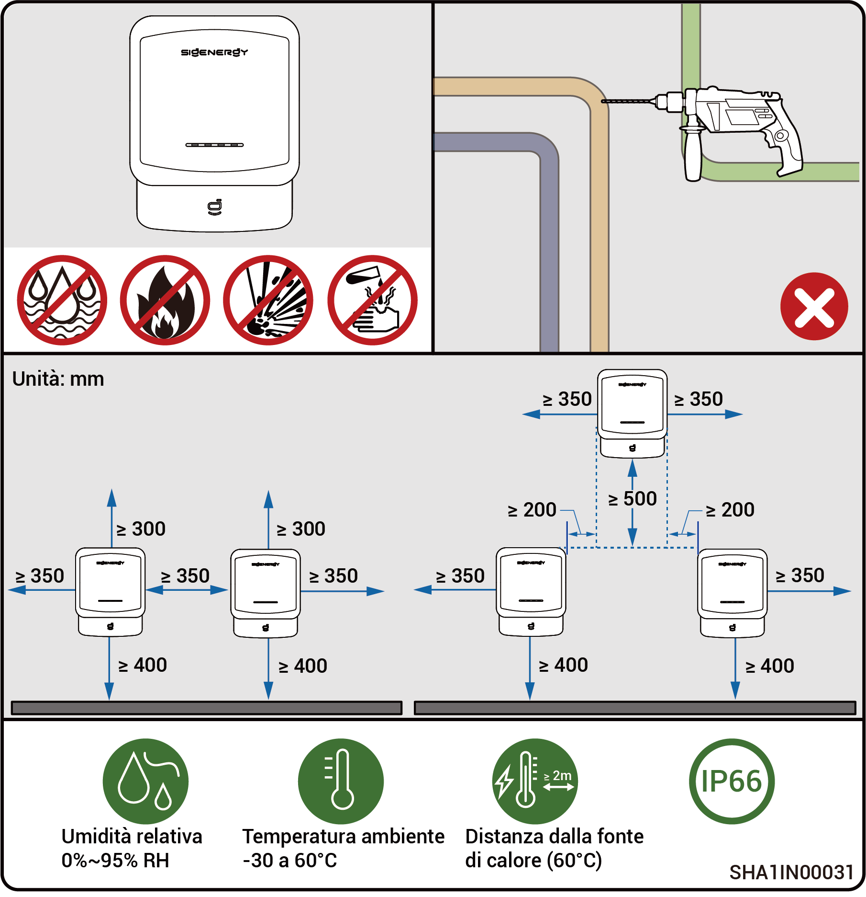
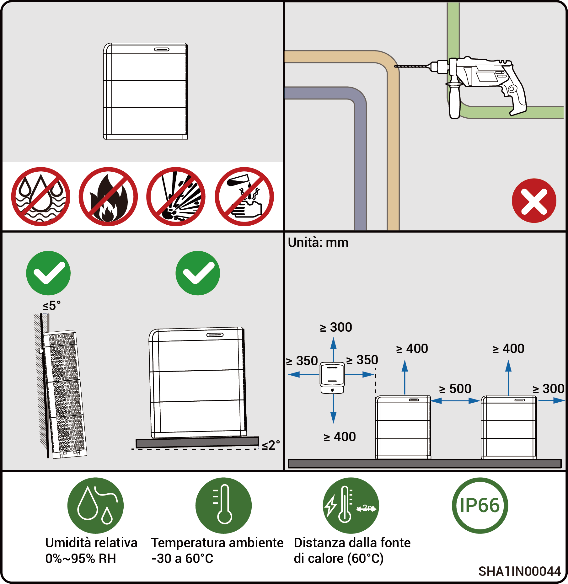

# Requisiti per la scelta del sito



* <mark style="color:blue;">**Prima di procedere con l'installazione dell'apparecchiatura, leggere attentamente i seguenti requisiti di installazione. L'azienda non sarà responsabile di eventuali malfunzionamenti o danni derivanti dall'uso dell'apparecchiatura, in caso di mancato rispetto dei requisiti di installazione, anche qualora ciò comporti incidenti che riguardano la sicurezza delle persone.**</mark>
* <mark style="color:blue;">**Durante l'installazione vera e propria, il luogo dell'installazione deve essere scelto rispettando le normative locali, le normative antincendio e le altre leggi pertinenti. La pianificazione del luogo specifico di installazione deve essere soggetta all'installatore o ai contratti di ingegneria, approvvigionamento e costruzione (EPC).**</mark>

### **Requisiti dell'ambiente di installazione**

* Non installare il dispositivo in un ambiente fumoso, infiammabile o esplosivo.
* Evitare di esporre il dispositivo alla luce diretta del sole, all'acqua stagnante, alla neve o alla polvere. Si consiglia di installare il dispositivo in un luogo riparato. Intraprendere le misure protettive necessarie in presenza di zone operative soggette a calamità naturali come inondazioni, frane, terremoti e tifoni.
* Non installare il dispositivo in un ambiente con forti interferenze elettromagnetiche.
* La temperatura e l'umidità dell'ambiente di installazione devono soddisfare i requisiti del dispositivo.
* Il dispositivo deve essere installato in una zona distante almeno 500 m da fonti di corrosione che possono causare danni dovuti al sale o a sostanze acide. Le fonti di corrosione comprendono ad esempio i luoghi costieri, le centrali termoelettriche, gli impianti chimici, le fonderie, le centrali a carbone, le industrie della gomma e gli impianti galvanici.
* In aree marine con condizioni favorevoli (ad esempio in Norvegia, dove la salinità costiera è ≤ 28 psu), è possibile ridurre la distanza dala costa, mantenendola comunque pari o superiore ai 200 m.
* In caso di danneggiamento della superficie esterna dell'apparecchiatura, provvedere tempestivamente a riverniciarla.

### **Requisiti di posizionamento per l'installazione**

* Non inclinare il dispositivo né posizionarlo in modo capovolto. Assicurarsi che il dispositivo sia installato orizzontalmente.
* Non installare il dispositivo in zone facilmente accessibili ai bambini.
* Non installare il dispositivo in un luogo a rischio di incendio o soggetto all'umidità.
* Il dispositivo emette rumore quando è in funzione. Installare il dispositivo in un luogo posto a una distanza opportuna in modo che non si abbia alcun impatto sull'attività e sulla vita quotidiana.
* Non installare il dispositivo in un luogo chiuso e poco ventilato senza le opportune misure antincendio e se il luogo risulta inaccessibile per l'estinzione di un eventuale incendio.
* Il dispositivo si surriscalda quando è in funzione. Se il dispositivo è installato in un ambiente chiuso, assicurare una buona ventilazione all'interno ed evitare notevoli aumenti della temperatura interna superiori a 3 °C mentre il dispositivo è in funzione. Altrimenti, si verificherà un calo delle prestazioni dell'apparecchiatura.
* Non installare l'apparecchiatura in ambienti mobili come camper, navi da crociera e treni.
* Si consiglia di installare il dispositivo in un luogo facilmente accessibile per la sua installazione, gestione, manutenzione e per controllare l'indicatore di stato.
* Per evitare collisioni, non posizionare il dispositivo in una zona di passaggio dei veicoli quando si effettua l'installazione in un garage.

### **Requisiti della superficie di montaggio**

* Non installare l'apparecchiatura su una base infiammabile.
* La base di installazione deve essere in grado di sostenere il carico. Si consigliano strutture in mattoni di cemento, pareti e pavimenti in cemento.
* La base di installazione deve essere piana e la zona di installazione deve soddisfare i requisiti dello spazio di installazione.
* Non devono essere presenti tubazioni o passaggi di cavi elettrici nella base di installazione per evitare potenziali rischi quando si praticano i fori durante l'installazione del dispositivo.
* La base dell'apparecchiatura è in alluminio. Se l'apparecchiatura viene installata su un substrato metallico che è soggetto a corrosione elettrochimica (ad esempio acciaio inossidabile ad alto contenuto di cromo, acciaio inossidabile austenitico e acciaio nichelato), assicurarsi di installare delle guarnizioni isolanti, in modo da coprire l'intera interfaccia tra l'apparecchiatura e il substrato. A tal fine, è possibile utilizzare guarnizioni isolanti non metalliche in PC, PTFE o PVDF.

<figure><figcaption></figcaption></figure>

<figure><figcaption></figcaption></figure>



* <mark style="color:blue;">L'intervallo massimo di temperatura di esercizio applicabile al dispositivo è da -20 °C a 55 °C, e l'intervallo ottimale di temperatura di esercizio raccomandato è 10 °C ≤ T ≤ 35 °C.</mark>
* <mark style="color:blue;">Quando la temperatura del pacco batteria è inferiore a 0 °C, non è possibile ricaricare immediatamente; il pacco batteria attiverà la funzione di riscaldamento automaticamente (il modulo di riscaldamento può essere attivato automaticamente). Le migliori prestazioni di ricarica della batteria possono essere ottenute in meno di 2 h di riscaldamento. La funzione di riscaldamento consuma energia.</mark>
* <mark style="color:blue;">A una temperatura superiore ai 40 °C, il dispositivo può attivare un declassamento della potenza che gli impedisce di funzionare in modo ottimale. Più alta sarà la temperatura, minore sarà la vita utile del dispositivo.</mark>
