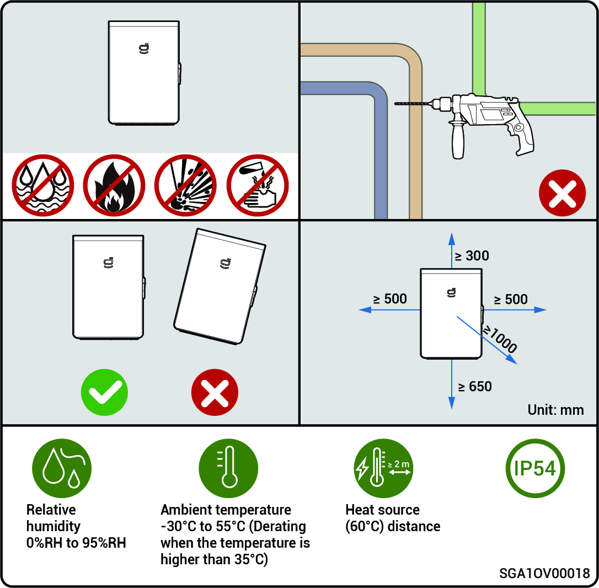

# Location Requirements



* <mark style="color:blue;">**The warranty applies when the equipment has been installed properly for its intended use and in accordance with the operating instructions.**</mark>
* <mark style="color:blue;">**During actual installation, the selection of installation location should comply with local firefighting, environmental protection regulations, and other relevant laws. The specific installation location planning should be subject to the installer or engineering, procurement, and construction (EPC) contracts.**</mark>

### **Installation Environment Requirements**

* Do not install the equipment in a smoky, flammable, or explosive environment.
* Do not install the equipment in an environment with conductive metal dust or magnetic dust.
* Do not install the equipment in an environment that is prone to mold and fungi.
* Do not install the equipment in an environment with strong electromagnetic interference.
* The temperature and humidity of the installation environment should meet equipment requirements.
* The equipment should be installed in an area that is at least 500 m away from corrosion sources that may result in salt or acid damage (corrosion sources include but are not limited to seaside, thermal power plants, chemical plants, smelters, coal plants, rubber plants, and electroplating plants).
* In areas with good marine environments (such as Norway, where the nearshore salinity is ≤ 28 psu), the mounting distance of the device from the coastline can be appropriately relaxed to ≥ 200 m.
* If the outer surface of the device is damaged, please repaint the device in time.

### **Installation Location Requirements**

* Do not tilt the equipment or place it upside down. Ensure that the equipment is horizontally installed.
* Do not install the equipment in a place with fire hazards or is prone to moisturizing.
* Do not install the equipment in a sealed, poorly ventilated location without fire protection measures and difficult access for firefighters.
* Do not install the equipment under water sources, including but not limited to water pipes and air conditioner outlet windows, where condensate or water leakage may occur. Otherwise, liquid may enter the equipment and cause short circuit.
* Do not install the equipment in mobile scenarios such as recreational vehicles, cruise ships, and trains.
* The equipment is hot when it is operating. If the equipment is installed indoors, please ensure good indoor ventilation and avoid significant indoor temperature rise by more than 3°C while the equipment is operating. Otherwise, the equipment will be derated.
* The equipment generates heat when it is operating. Do not install the equipment in areas easily accessible to heat dissipation surfaces.
* You are advised to install the equipment in a location where you can easily access, install, operate, maintain it, and view the indicator status.
* The on-grid/off-grid switchover makes noise. It is recommended that the equipment be installed near the AC distribution box, away from the rest area.

### **Installation Base Requirements**

* Do not install the equipment on a flammable base.
* The installation base should meet the load-bearing requirement and should be free of adverse geological conditions including but not limited to rubber soil and soft soil. Solid brick-concrete structures and concrete walls are recommended.
* The installation base should be flat, and the installation area should meet the installation space requirements.
* No plumbing or electrical alignments should be inside the installation base to avoid potential drilling hazards during equipment installation.

<figure><figcaption></figcaption></figure>
