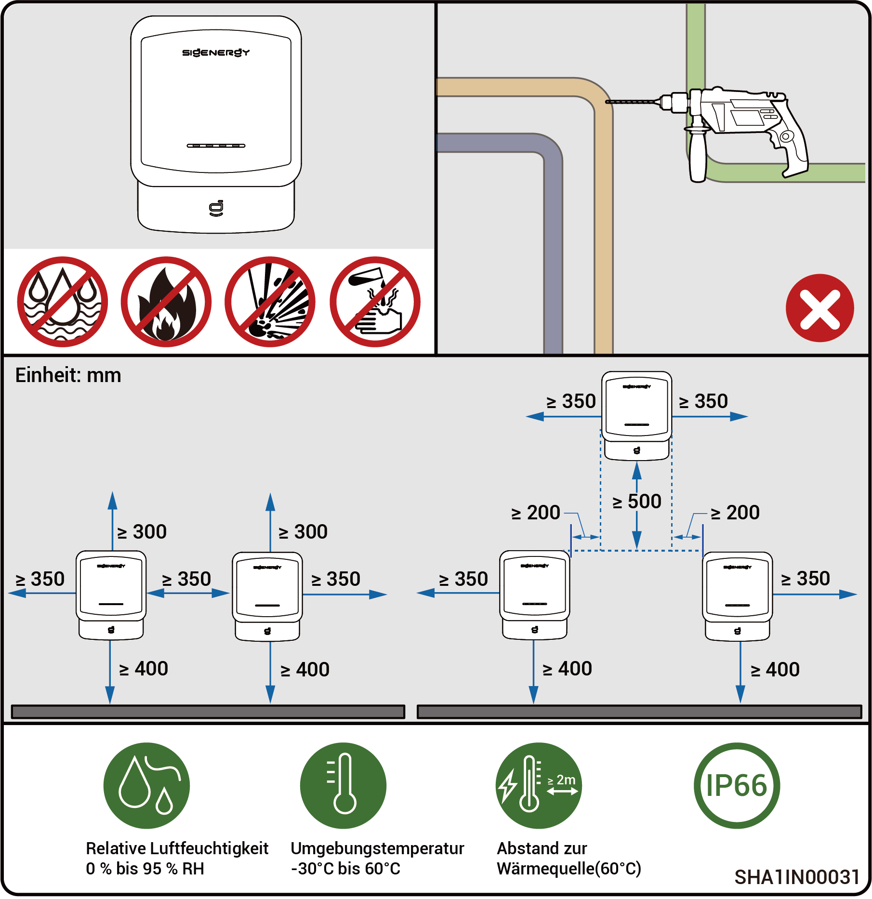

# Anforderungen an die Standortwahl



* <mark style="color:blue;">**Bevor Sie das Gerät installieren, lesen Sie bitte die folgenden Installationsanforderungen sorgfältig durch. Das Unternehmen haftet nicht für Funktionsstörungen oder Schäden, die durch den Betrieb der Ausrüstung entstehen, wenn die Installationsanforderungen nicht befolgt werden, auch nicht in Fällen, die zu Vorfällen im Zusammenhang mit der persönlichen Sicherheit führen.**</mark>
* <mark style="color:blue;">**Bei der eigentlichen Installation sollte die Auswahl des Installationsortes den örtlichen Vorschriften, Brandschutzvorschriften und anderen relevanten Gesetzen entsprechen. Die spezifische Planung des Installationsstandorts sollte den Verträgen mit dem Installations-, Ingenieurs-, Beschaffungs- oder Bauunternehmen (EPC) entsprechen.**</mark>

### **Anforderungen an die Installationsumgebung**

* Installieren Sie das Produkt nicht in rauchigen, entzündlichen oder explosionsgefährdeten Umgebungen.
* Setzen Sie das Produkt nicht direktem Sonnenlicht, Regen, stehendem Wasser, Schnee oder Staub aus. Es wird empfohlen, die Ausrüstung an einem geschützten Ort aufzustellen. Ergreifen Sie Schutzmaßnahmen in Betriebsumgebungen, die für Naturkatastrophen wie Überschwemmungen, Schlammlawinen, Erdbeben und Taifune anfällig sind.
* Installieren Sie das Produkt nicht in einer Umgebung mit starken elektromagnetischen Störungen.
* Die Temperatur und die Luftfeuchtigkeit der Installationsumgebung sollten den Geräteanforderungen entsprechen.
* Das Gerät sollte in einem Bereich installiert werden, der mindestens 500 m von Korrosionsquellen entfernt ist, die zu Salz- oder Säureschäden führen können. Zu den Korrosionsquellen gehören u. a. Meeresküsten, Wärmekraftwerke, Chemiewerke, Schmelzhütten, Kohlewerke, Gummifabriken und Galvanikbetriebe.
* In Gebieten mit guter Meeresumwelt (wie z. B. Norwegen, wo der Salzgehalt in Küstennähe ≤ 28 psu beträgt) kann der Einbauabstand des Geräts von der Küstenlinie auf angemessene ≥ 200 m gelockert werden.
* Wenn die Außenfläche des Geräts beschädigt ist, streichen Sie das Gerät bitte rechtzeitig erneut.

### **Anforderungen an die Installationsposition**

* Das Gerät nicht neigen oder auf den Kopf stellen. Stellen Sie sicher, dass das Gerät horizontal installiert wird.
* Installieren Sie das Produkt nicht an einem Ort, der für Kinder leicht zugänglich ist.
* Installieren Sie das Gerät nicht an einem feuergefährdeten oder feuchtigkeitsanfälligen Ort.
* Das Gerät verursacht während des Betriebs Geräusche. Bitte installieren Sie die Geräte an einem Ort mit ausreichendem Abstand, an dem sie die tägliche Arbeit und das Leben nicht beeinträchtigen.
* Installieren Sie das Gerät nicht an einem geschlossenen, schlecht belüfteten Ort ohne Brandschutzmaßnahmen und mit erschwertem Zugang für die Feuerwehr.
* Das Gerät wird während des Betriebs heiß. Wenn das Gerät in einem Innenraum aufgestellt wird, sorgen Sie bitte für gute Innenraumbelüftung und vermeiden Sie während des Gerätebetriebs im Innenraum erhebliche Temperaturanstiege um mehr als 3 °C. Ist dies nicht der Fall, wird die Leistung des Gerätes reduziert.
* Installieren Sie das Produkt nicht in mobilen Szenarien wie Wohnmobile, Kreuzfahrtschiffe und Züge.
* Es wird empfohlen, das Gerät so zu installieren, dass es gut zugänglich, leicht zu bedienen und zu warten ist und dass die Statusanzeigen gut sichtbar sind.
* Stellen Sie das Gerät nicht in den Fahrweg des Fahrzeugs, wenn es in einer Garage installiert ist, um Kollisionen zu vermeiden.

### **Anforderungen an die Montagefläche**

* Installieren Sie das Gerät nicht auf einem brennbaren Untergrund.
* Die Installationsgrundlage muss den Anforderungen an die Tragfähigkeit entsprechen. Empfohlen werden eine solide Struktur aus Ziegeln und Beton, Betonwände und -boden.
* Der Installationsuntergrund sollte flach sein und der Installationsbereich sollte die Anforderungen an den Installationsraum erfüllen.
* Im Installationsbereich sind keine Sanitär- oder Elektroarbeiten erlaubt, um mögliche Gefahren durch Bohrarbeiten während der Installation der Geräte zu vermeiden.
* Der Gerätesockel ist aus Aluminium gefertigt. Wenn das Gerät auf einem metallischen Untergrund installiert wird, der anfällig für elektrochemische Korrosion ist (z. B. hochchromhaltiger Edelstahl, austenitischer Edelstahl und vernickelter Stahl), müssen isolierende Dichtungen vollständig zwischen dem Gerät und dem Untergrund installiert werden. (Es können nicht-metallische isolierende Dichtungen wie PC, PTFE oder PVDF verwendet werden).

<figure><figcaption></figcaption></figure>

<figure><figcaption></figcaption></figure>



* <mark style="color:blue;">Der maximale Betriebstemperaturbereich für das Gerät liegt zwischen -20 °C und 55 °C. Der empfohlene optimale Betriebstemperaturbereich liegt zwischen 10 °C ≤ T ≤ 35 °C.</mark>
* <mark style="color:blue;">Wenn die Temperatur des Akkupacks unter 0 °C liegt, ist ein sofortiges Laden nicht möglich, und der Akkupack (das integrierte Heizmodul kann automatisch aktiviert werden) aktiviert die Heizfunktion automatisch. Die beste Ladeleistung des Akkus kann nach weniger als 2 Stunden Erwärmung erreicht werden. Die Heizfunktion verbraucht Strom.</mark>
* <mark style="color:blue;">Bei einer Temperatur > 40 °C kann der Betrieb der Geräte zu einer Leistungsminderung führen, die einen optimalen Betrieb der Geräte verhindert. Je höher die Temperatur, desto kürzer die Lebensdauer der Geräte.</mark>
