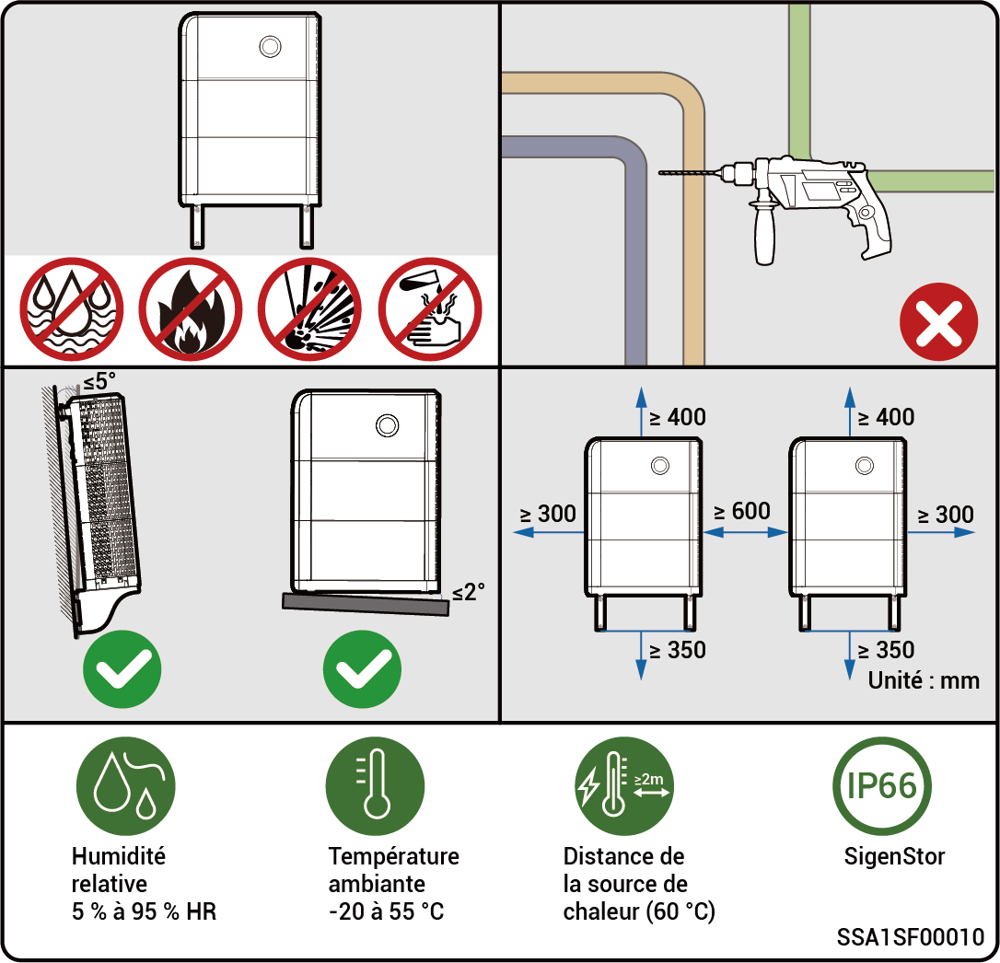

# Conditions de choix du site



* <mark style="color:blue;">**Avant d'installer l'équipement, lisez attentivement les conditions d'installation suivantes. L'entreprise ne sera pas tenue responsable des anomalies fonctionnelles ou des dommages résultant du fonctionnement de l'équipement si les conditions d'installation ne sont pas respectées, même dans les cas entraînant des risques liés à la sécurité des personnes.**</mark>
* <mark style="color:blue;">**Lors de l'installation proprement dite, le choix du lieu d'installation doit être conforme aux réglementations locales, aux réglementations en matière de lutte contre l'incendie et à d'autres lois pertinentes. Le choix de l'emplacement spécifique de l'installation doit être soumis à l'installateur ou aux contrats d'ingénierie, d'approvisionnement et de construction (EPC).**</mark>

### **Conditions requises pour l'environnement d'installation**

* N'installez pas l'équipement dans un environnement enfumé, inflammable ou explosif.
* Évitez d'exposer l'équipement à la lumière directe du soleil, à la pluie, à l'eau stagnante, à la neige ou à la poussière. Il est conseillé d'installer l'équipement dans un endroit abrité. Prenez des mesures préventives dans les lieux d'exploitation exposés aux catastrophes naturelles, telles que les inondations, les coulées de boue, les tremblements de terre et les typhons.
* N'installez pas l'équipement dans un environnement exposé à de fortes interférences électromagnétiques.
* La température et l'humidité de l'environnement d'installation doivent être conformes aux caractéristiques de l'équipement.
* L'équipement doit être installé dans une zone située à au moins 500 m de sources de corrosion susceptibles d'entraîner des dommages dus au sel ou à l'acide. Les sources de corrosion comprennent, entre autres, les bords de mer, les centrales thermiques, les usines chimiques, les fonderies, les usines de production de charbon, les usines de production de caoutchouc et les usines de galvanisation.

### **Conditions requises pour l'emplacement d'installation**

* N'inclinez pas l'équipement et ne le placez pas à l'envers. Assurez-vous que l'équipement est installé horizontalement.
* N'installez pas l'équipement dans des endroits facilement accessibles aux enfants.
* N'installez pas l'équipement dans un endroit présentant des risques d'incendie ou exposé à l'humidité.
* L'équipement émet du bruit lors de son fonctionnement. Installez l'équipement à un endroit situé à une distance appropriée, de manière à ne pas perturber le travail et la vie quotidienne.
* N'installez pas l'équipement dans un endroit clos, mal ventilé, dépourvu de mesures de protection contre l'incendie et inaccessible aux pompiers.
* L'équipement est chaud lors de son fonctionnement. Si l'équipement est installé à l'intérieur, assurez une bonne ventilation et évitez toute hausse significative de 3 °C de la température à l'intérieur lorsque l'équipement est en fonctionnement. Dans le cas contraire, l'équipement subira des dégradations.
* N'installez pas l'équipement dans des situations de déplacement, telles que les véhicules de loisirs, les bateaux de croisière et les trains.
* Il est recommandé d'installer l'équipement dans un endroit facilement accessible, où vous pourrez l'installer, le faire fonctionner, l'entretenir et consulter l'état des indicateurs.
* Ne placez pas l'équipement sur la voie de passage de véhicules lorsqu'ils sont installés dans un garage, afin d'éviter les collisions.

### **Conditions requises pour la surface de montage**

* N'installez pas l'équipement sur une base inflammable.
* La base d'installation doit répondre aux conditions de portance. Des structures solides en briques et en béton, des murs et des sols en béton sont recommandés.
* La base d'installation doit être plane et la zone d'installation doit être conforme aux conditions d'encombrement de l'installation.
* Aucun réseau de plomberie ou d'électricité n'est admis à l'intérieur de la base d'installation afin d'éviter tout risque de perçage lors de l'installation de l'équipement.

<figure><figcaption></figcaption></figure>



* <mark style="color:blue;">La plage de température de fonctionnement maximale admissible pour l'équipement est comprise entre -20 °C et +55 °C. La plage de température de fonctionnement optimale recommandée est de 10 °C ≤ T ≤ 35 °C.</mark>
* <mark style="color:blue;">Si la température du bloc-batterie est inférieure à 0 °C, la charge immédiate n'est pas possible. Le bloc-batterie (il est possible d'activer automatiquement le module de chauffage intégré) activera automatiquement la fonction de chauffage. Les meilleures performances de charge de la batterie peuvent être obtenues après un chauffage de moins de 2 h. La fonction de chauffage consomme de l'énergie.</mark>
* <mark style="color:blue;">À une température > 40 °C, le fonctionnement de l'équipement peut déclencher une réduction de puissance qui empêche l'équipement de fonctionner de manière optimale. Plus la température est élevée, plus la durée de service de l'équipement est courte.</mark>
