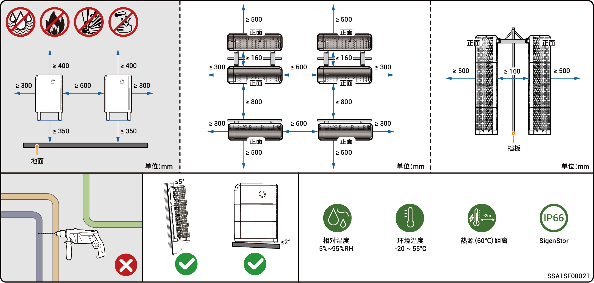

# 选址要求



* <mark style="color:blue;">在安装设备之前，请务必仔细阅读以下安装要求。如果因未按照要求操作而导致设备在运行过程中出现功能异常、损坏，甚至引发人身安全事故，本公司将不承担任何责任。</mark>
* <mark style="color:blue;">实际安装时，安装位置的选定应同时满足当地消防、环保等法规，具体安装位置规划以安装商或EPC（Engineering，Procurement，Construction）为准。</mark>

### **安装环境要求**

* 禁止将设备安装于烟雾、易燃、易爆、易腐蚀的环境中。
* 避免将设备安装于阳光直射、雨淋、积水、积雪、沙尘等环境中，建议安装于有遮挡的位置。若当地易发生洪水、泥石流、地震、台风等自然灾害，安装设备时需要采取防范措施。
* 禁止将设备安装于强电磁干扰的环境中。
* 安装环境的温度与湿度要符合设备要求。
* 设备应安装于距高盐或高酸等腐蚀源≥500m 的地区（腐蚀源包括但不限于海边、火电厂、化工厂、冶炼厂、煤厂、橡胶厂、电镀厂等)。
* 在海洋环境良好（挪威等近岸盐度 ≤ 28 psu）的地区，设备安装距海岸线区域可适当放宽至≥200m。
* 若设备出现外表面破损情况，请及时对设备进行补漆。

### **安装位置要求**

* 禁止设备倾斜、倒置，确保设备水平安装。
* 禁止将设备安装于儿童易触碰的位置。
* 禁止将设备安装于有火源或潮湿的位置。
* 设备运行会产生声音，安装时请远离日常工作、生活起居的位置。
* 禁止将设备安装于密闭、不通风、未配置消防设施且消防人员难以到达的位置。
* 设备运行会发热。若将设备安装于室内，请确保室内通风良好，禁止出现由于设备运行而导致室内温度升高超过3℃的情况，避免温度升高导致设备降额。
* 禁止将设备安装于房车、游轮、火车等移动场景中。
* 推荐将设备安装于易通行、易安装、易操作、易维护、易查看指示灯状态的位置。
* 安装于车库时，禁止将设备安装在车辆通行的位置，以免发生碰撞。

### **安装载体要求**

* 禁止将设备安装于易燃载体上。若无法避免，请在设备与载体间增加防火层。
* 安装载体符合承重要求，推荐选择实心砖混结构、混凝土墙体和地面。
* 安装载体表面要平整，可安装区域要满足设备安装空间要求。
* 安装载体内部无水电走线，以免安装设备时钻孔发生危险。

<figure><figcaption></figcaption></figure>



* <mark style="color:blue;">设备支持的最大工作温度范围为-20℃～55℃，推荐的最优工作温度范围为10℃≤T≤35℃。</mark>
* <mark style="color:blue;">当电池包温度＜0℃时，无法立即充电，电池包（内置的加热模块能自动开启）会开启加热功能，加热＜2h后，电池方可达到最好的充电性能。加热功能会消耗电量。</mark>
* <mark style="color:blue;">当温度＞40℃时，设备运行可能会触发功率降额，使设备无法达到最佳运行状态。温度越高，设备使用寿命越短。</mark>
