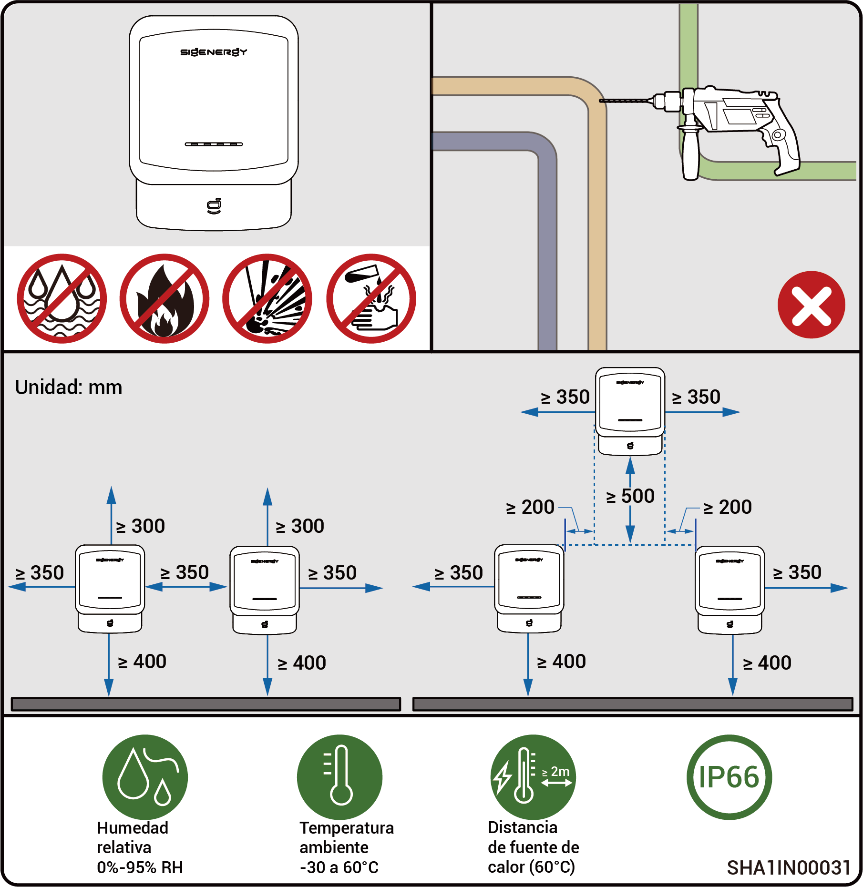
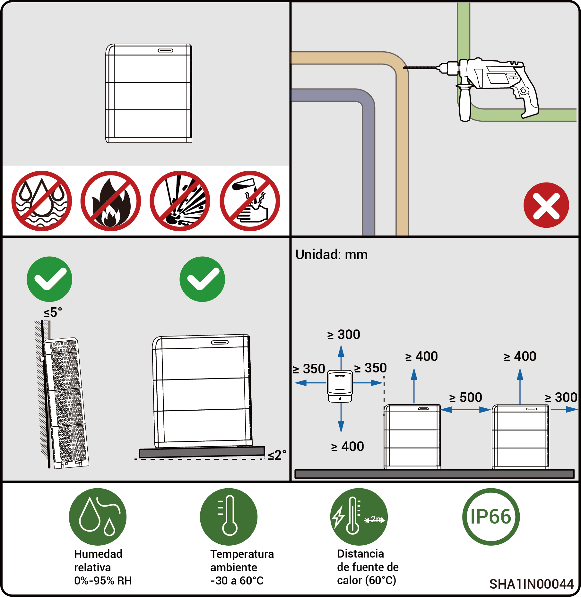

# Requisitos de selección del lugar



* <mark style="color:blue;">**Antes de instalar este equipo, asegúrese de leer atentamente los requisitos de instalación siguientes. La empresa no será responsable de ninguna anomalía funcional ni daño resultante del funcionamiento del equipo si no se respetan los requisitos de instalación, incluso en casos que provoquen daños personales.**</mark>
* <mark style="color:blue;">**Durante la instalación real, la selección del lugar de instalación debe cumplir las regulaciones locales, las regulaciones de prevención de incendios y las demás leyes pertinentes. La planificación de la ubicación de la instalación concreta debe establecerse en los contratos del instalador o de ingeniería, abastecimiento y construcción.**</mark>

### **Requisitos ambientales de instalación**

* No instale el equipo en un ambiente con humo, inflamable ni explosivo.
* Evite exponer el equipo a la radiación solar directa, lluvia, agua estancada, nieve o polvo. Recomendamos instalar el equipo en un lugar protegido. Tome medidas preventivas en zonas con tendencia a desastres naturales como inundaciones, corrimientos, terremotos o huracanes.
* No instale el equipo en un entorno con interferencias electromagnéticas fuertes.
* La temperatura y humedad del entorno de instalación deben cumplir los requisitos de los equipos.
* El equipo debe instalarse en una zona apartada 500 m como mínimo de fuentes de corrosión que puedan provocar daños por sal o por ácidos. Las fuentes de corrosión son, entre otras, costas, plantas generadoras térmicas, plantas químicas, fundiciones, plantas de carbón, plantas de caucho o plantas de electrodeposición.
* En zonas con entornos marinos suaves (como Noruega, donde la salinidad costera es ≤ 28 psu), la distancia de montaje del dispositivo respecto a la línea costera puede relajarse sin problemas a ≥ 200 m.
* Si la superficie exterior del dispositivo está dañada, repinte el dispositivo a tiempo.

### **Requisitos de posición de instalación**

* No incline el equipo ni lo coloque boca abajo. Asegúrese de que el equipo esté instalado horizontalmente.
* No instale el equipo en zonas fácilmente accesibles para niños.
* No instale el equipo en lugares con riesgo de incendio ni con tendencia a la humedad.
* Cuando está en funcionamiento, el equipo genera ruido. Instale el equipo en un lugar a una distancia suficiente para no afectar la vida ni el trabajo cotidianos.
* No instale el equipo en un lugar cerrado y poco ventilado, sin medidas de protección contra incendios o inaccesible para los bomberos.
* Cuando está en funcionamiento, el equipo se calienta. Si el equipo se instala en un interior, asegure una buena ventilación y evite un aumento de la temperatura del interior superior a 3 °C mientras el equipo está en marcha. En caso contrario el equipo funcionará en modo degradado.
* No instale el equipo en escenarios móviles como autocaravanas, cruceros o trenes.
* Se recomienda instalar el equipo en un lugar al que pueda acceder fácilmente para instalarlo, utilizarlo, mantenerlo y ver el estado de los indicadores.
* Si instala el vehículo en un garaje, no lo coloque en un paso de vehículos para evitar colisiones.

### **Requisitos de la superficie de montaje**

* No instale el equipo sobre una base inflamable.
* La base de instalación debe cumplir los requisitos de capacidad de carga. Se recomiendan estructuras macizas de ladrillo y hormigón y paredes y suelos de hormigón.
* La base de instalación debe ser plana y la zona de instalación debe cumplir los requisitos de espacio de instalación.
* Durante la instalación del equipo no están permitidas las líneas de agua ni eléctricas dentro de la base de instalación para evitar riesgos de perforación.
* La base del equipo es de aluminio. Si el equipo está instalado sobre una superficie metálica que sea susceptible de corrosión electroquímica (como acero inoxidable con alto contenido de cromo, acero inoxidable austenítico o acero niquelado), deben colocarse juntas aislantes en toda la superficie entre el equipo y la superficie. (Pueden utilizarse juntas aislantes no metálicas como PC, PTFE o PVDF)

<figure><figcaption></figcaption></figure>

<figure><figcaption></figcaption></figure>



* <mark style="color:blue;">El rango máximo de temperaturas de funcionamiento aplicable al equipo es de -20 a 55 °C y el rango de temperaturas de funcionamiento óptimo recomendado de 10 ≤ T ≤ 35 °C.</mark>
* <mark style="color:blue;">Si la temperatura del paquete de baterías es inferior a 0 °C, no es posible cargar inmediatamente y el paquete de baterías (el módulo calefactor integrado puede habilitarse automáticamente) activará automáticamente la función de calentamiento. Las mejores prestaciones de carga de la batería se consiguen después de calentarse menos de 2 h. La función de calentamiento consume energía.</mark>
* <mark style="color:blue;">A una temperatura > 40 °C, el funcionamiento del equipo puede activar una reducción eléctrica que impide que el equipo funcione de forma óptima. Cuanto más alta la temperatura menor vida de servicio del equipo.</mark>
