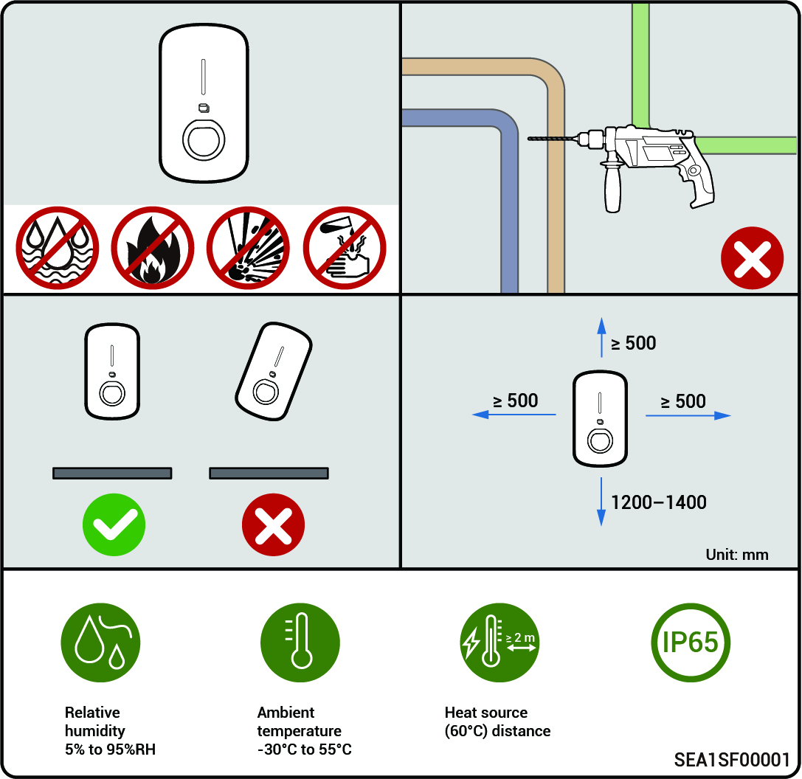

# Location Requirements



* <mark style="color:blue;">The equipment can be installed indoors and outdoors. Install the equipment in strict accordance with installation instructions given in this section and local laws and regulations.</mark>
* <mark style="color:blue;">The warranty applies when the equipment has been installed properly for its intended use and in accordance with the operating instructions</mark><mark style="color:blue;">**.**</mark>
* <mark style="color:blue;">During actual installation, the selection of the installation location should comply with local regulations, firefighting regulations, and other relevant laws. The specific installation location planning should be subject to the installer or engineering, procurement, and construction (EPC) contracts.</mark>

### **Installation Environment Requirements**

* Do not install the equipment in smoky, flammable, explosive, or corrosive environments.
* Avoid exposing the equipment to direct sunlight, rain, standing water, snow, or dust. Install the equipment in a sheltered place. Take preventive measures in operating areas prone to natural disasters such as floods, mudslides, earthquakes, and typhoons.
* Do not install the equipment in an environment with strong electromagnetic interference.
* Ensure that the temperature and humidity of the installation environment comply with the equipment's requirements.
* The equipment should be installed in an area that is at least 500 m away from corrosion sources that may result in salt damage or acid damage (corrosion sources include but are not limited to seaside, thermal power plants, chemical plants, smelters, coal plants, rubber plants, and electroplating plants).
* In areas with good marine environments (such as Norway, where the nearshore salinity is ≤ 28 psu), the mounting distance of the device from the coastline can be appropriately relaxed to ≥ 200 m.
* If the outer surface of the device is damaged, please repaint the device in time.

### **Installation Position Requirements**

* Do not tilt or overturn the equipment to ensure that it is installed horizontally.
* Do not install the equipment in a place easily touched by children.
* Do not install the equipment in mobile scenarios such as RVS, cruise ships, and trains.
* You are advised to install the equipment in a position that is easy to operate, maintain, and view indicator status.
* When installing the equipment in the garage, do not install the equipment in the position where the vehicle passes through to avoid collision.

### **Mounting surface**

* Do not install the equipment on a flammable carrier.
* The installation carrier must meet load-bearing requirements. Solid brick-concrete structure, concrete walls are recommended.
* The surface of the installation carrier must be smooth and the installation area must meet the installation space requirements.
* No water or electricity is routed inside the carrier to prevent drilling hazards during equipment installation.

<figure><figcaption></figcaption></figure>
