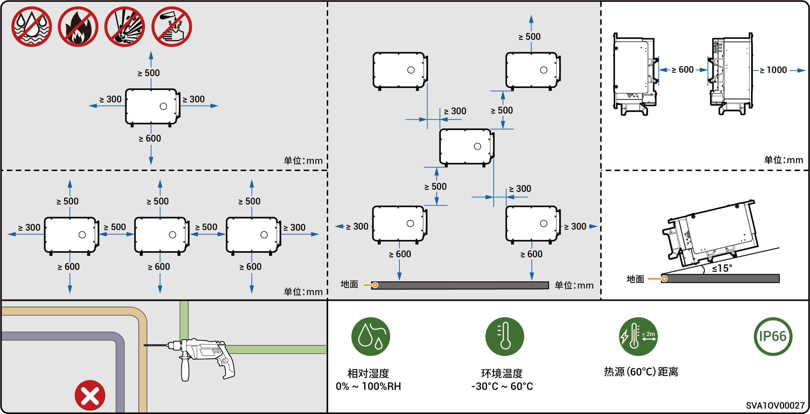

# 选址要求



* <mark style="color:blue;">在安装设备之前，请务必仔细阅读以下安装要求。如果因未按照要求操作而导致设备在运行过程中出现功能异常、损坏，甚至引发人身安全事故，本公司将不承担任何责任。</mark>
* <mark style="color:blue;">实际安装时，安装位置的选定应同时满足当地消防、环保等法规，具体安装位置规划以安装商或EPC（Engineering，Procurement，Construction）为准。</mark>

### **安装环境要求**

* 禁止将设备安装于烟雾、易燃、易爆的环境中。
* 禁止将设备安装于有导电性金属粉尘、导磁性尘埃的环境中。
* 禁止将设备安装于易滋生霉菌、真菌等的环境中。
* 避免将设备安装于阳光直射、雨淋、积水、积雪、沙尘等环境中，建议安装于有遮挡的位置。若当地易发生洪水、泥石流、地震、台风等自然灾害，安装设备时需要采取防范措施。
* 禁止将设备安装于强电磁干扰的环境中。
* 安装环境的温度与湿度要符合设备要求。
* 设备应安装于距高盐或高酸等腐蚀源≥500m 的地区（腐蚀源包括但不限于海边、火电厂、化工厂、冶炼厂、煤厂、橡胶厂、电镀厂等)。
* 在海洋环境良好（挪威等近岸盐度 ≤ 28 psu）的地区，设备安装距海岸线区域可适当放宽至≥200m。
* 若设备出现外表面破损情况，请及时对设备进行补漆。

### **安装位置要求**

* 禁止设备倾斜、倒置，确保设备水平安装。
* 禁止将设备安装于有火源或潮湿的位置。
* 禁止将设备安装于密闭、不通风、未配置消防设施且消防人员难以到达的位置。
* 禁止将设备安装于水源下方，包含但不限于水管、空调出线窗等易产生冷凝水或漏水的下方，避免液体进入设备内部造成短路。
* 设备运行会发热。若将设备安装于室内，请确保室内通风良好，禁止出现由于设备运行而导致室内温度升高超过3℃的情况，避免温度升高导致设备降额。
* 设备运行时会发热，避免将设备安装于易触碰散热区域的位置。
* 禁止将设备安装于房车、游轮、火车等移动场景中。
* 推荐将设备安装于易通行、易安装、易操作、易维护、易查看指示灯状态的位置。
* 推荐逆变器与上级变压器的交流线缆长度≤600米。若大于600米，可能会对逆变器的并机运行产生影响，请联系思格新能源获取进一步建议。
* 如果设备安装在除工作和生活区域以外的公共场合（如停车场、车站、厂房等），请在设备外部安装防护网并竖立安全警示标志进行隔离，禁止不相关人员靠近逆变器，避免设备运行过程中由于非专业的人员意外接触或其他原因导致的人身伤害或财产损失。

### **安装载体要求**

* 禁止将设备安装于易燃载体上。
* 安装载体符合承重要求，不存在不良地质，包含但不限于有橡皮土、软弱土等，推荐选择实心砖混结构、混凝土墙体。
* 安装载体表面要平整，可安装区域要满足设备安装空间要求。
* 安装载体内部无水电走线，以免安装设备时钻孔发生危险。



<mark style="color:blue;">为确保设备最佳性能，建议设备与周边障碍物参考图示安装距离规划，若安装场景通风良好，您可根据实际情况部署最佳方案。</mark>
\ <mark style="color:blue;">为确保后续维护便利（如风扇进行日常检查或拆卸维修），建议设备左侧预留≥400mm。</mark>

### **纯光场景（纯光和HYA机型）**

<figure><figcaption></figcaption></figure>

### **纯光场景（HYB机型）**

<figure><figcaption></figcaption></figure>



* <mark style="color:blue;">为确保设备最佳性能，建议设备与周边障碍物参考图示安装距离规划，若安装场景通风良好，您可根据实际需求部署最佳方案。</mark>
* <mark style="color:blue;">为确保安装工具通行便利（如吊装工具、叉车），建议电池簇前方预留≥1500mm，您也可根据实际情况调整。</mark>
* <mark style="color:blue;">安装完成后，请保证设备底部不积水，必要时请添加排水通道。</mark>

### **光储场景**

<figure><figcaption></figcaption></figure>
