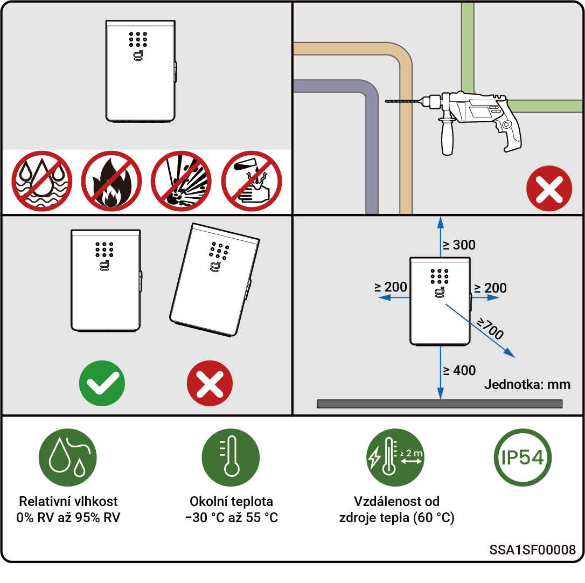

# Požadavky na umístění



* <mark style="color:blue;">**Záruka platí, pokud bylo zařízení správně nainstalováno pro svůj určený účel a&nbsp;v&nbsp;souladu s&nbsp;provozními pokyny.**</mark>
* <mark style="color:blue;">**Při samotné instalaci by výběr místa instalace měl být v&nbsp;souladu s&nbsp;místními protipožárními předpisy, předpisy na ochranu životního prostředí a&nbsp;dalšími příslušnými právními předpisy. Plánování konkrétního místa instalace by mělo podléhat smlouvám s&nbsp;dodavatelem instalačních prací nebo smlouvám o&nbsp;technickém zajištění, nákupu a&nbsp;výstavbě (EPC).**</mark>

### **Požadavky na prostředí instalace**

* Neinstalujte zařízení do zakouřeného, hořlavého nebo výbušného prostředí.
* Neinstalujte zařízení v&nbsp;prostředí s&nbsp;vodivým kovovým prachem nebo magnetickým prachem.
* Neinstalujte zařízení do prostředí náchylného na plísně a&nbsp;houby.
* Neinstalujte zařízení do prostředí se silným elektromagnetickým rušením.
* Teplota a&nbsp;vlhkost prostředí instalace by měly vyhovovat požadavkům zařízení.
* Zařízení by mělo být instalováno v&nbsp;oblasti, která je minimálně 500&nbsp;m vzdálená od zdrojů koroze, jež mohou způsobit poškození solí nebo kyselinami (zdroje koroze zahrnují, ale nejsou omezeny na pobřeží, tepelné elektrárny, chemické závody, hutě, uhelné elektrárny, gumárenské závody a&nbsp;galvanovny).
* V&nbsp;oblastech s&nbsp;dobrým mořským prostředím (například v&nbsp;Norsku, kde je slanost v&nbsp;pobřežní oblasti ≤&nbsp;28&nbsp;psu), lze vzdálenost montáže zařízení od pobřeží vhodně zkrátit na ≥&nbsp;200&nbsp;m.
* Pokud dojde k&nbsp;poškození vnějšího povrchu zařízení, je nutné jej včas přetřít.

### **Požadavky na místo instalace**

* Nenaklápějte zařízení a&nbsp;neumisťujte jej vzhůru nohama. Zajistěte, aby bylo zařízení instalováno vodorovně.
* Neinstalujte zařízení na místech s&nbsp;nebezpečím požáru nebo místech, která jsou náchylná k&nbsp;vlhkosti.
* Neinstalujte zařízení na neprodyšném, nedostatečně odvětrávaném místě, kde nebyla učiněna protipožární opatření a kde je obtížný přístup k hasicím přístrojům.
* Neinstalujte zařízení pod zdroje vody, například pod vodovodní potrubí a&nbsp;vývody klimatizace, kde může docházet ke kondenzaci nebo úniku vody. Do zařízení může jinak proniknout kapalina a&nbsp;způsobit zkrat.
* Neinstalujte zařízení v&nbsp;mobilních prostředích, jako jsou obytná vozidla, výletní lodě a&nbsp;vlaky.
* Zařízení je během provozu horké. Pokud je zařízení instalováno v&nbsp;interiéru, zajistěte dostatečné větrání a&nbsp;nedovolte, aby se při jeho provozu vnitřní teplota zvýšila o&nbsp;více než 3&nbsp;°C. Jinak by mohl být výkon zařízení omezen.
* Zařízení během provozu vytváří teplo. Neinstalujte zařízení na místech, kde jsou snadno přístupné povrchy odvádějící teplo.
* Je doporučeno instalovat zařízení na místo, kde bude snadné k zařízení přistupovat, instalovat jej, provozovat, udržovat a kde půjde sledovat stav indikátoru.
* Přepínání mezi režimem připojení k&nbsp;síti&nbsp;/ ostrovním režimem způsobuje hluk. Doporučuje se instalovat zařízení v&nbsp;blízkosti rozvaděče střídavého proudu, mimo zónu odpočinku.

### **Požadavky na instalační základnu**

* Neinstalujte zařízení na hořlavou základnu.
* Instalační základna by měla splňovat požadavky na nosnost a&nbsp;neměla by být vystavena nepříznivým geologickým podmínkám, např. pruživé půdy a&nbsp;měkké zeminy. Doporučují se pevné cihlobetonové konstrukce a&nbsp;betonové stěny.
* Instalační základna by měla být rovná a&nbsp;instalační prostor by měl splňovat požadavky na místo instalace.
* V&nbsp;instalační základně nesmí být žádné instalace vodovodních nebo elektrických rozvodů, aby se předešlo možným rizikům při vrtání během instalace zařízení.

<figure><figcaption></figcaption></figure>
