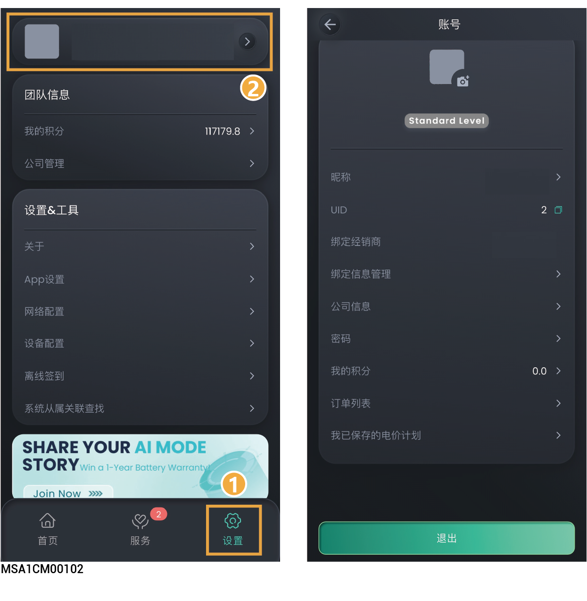
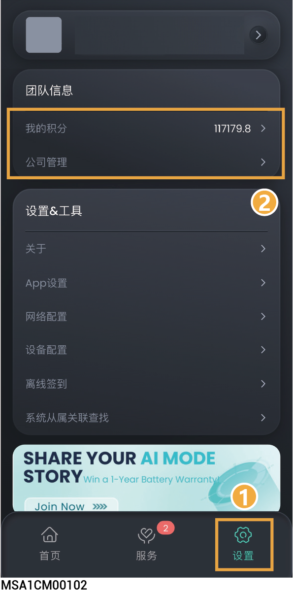

# 账号与团队设置

## **个人账号**

<figure><figcaption></figcaption></figure>

<table><thead><tr><th width="70" align="center" valign="middle">序号</th><th width="200.0909423828125" valign="middle">参数名称</th><th valign="top">说明</th></tr></thead><tbody><tr><td align="center" valign="middle">1</td><td valign="middle">昵称</td><td valign="top">点击修改账号昵称。</td></tr><tr><td align="center" valign="middle">2</td><td valign="middle">UID</td><td valign="top">点击复制个人用户 ID。</td></tr><tr><td align="center" valign="middle">3</td><td valign="middle">绑定经销商</td><td valign="top">点击查看绑定经销商信息。</td></tr><tr><td align="center" valign="middle">4</td><td valign="middle">绑定信息管理</td><td valign="top">点击修改账号绑定信息，如邮箱信息。</td></tr><tr><td align="center" valign="middle">5</td><td valign="middle">公司信息</td><td valign="top">点击可查看公司信息。</td></tr><tr><td align="center" valign="middle">6</td><td valign="middle">密码</td><td valign="top">点击修改账号密码。</td></tr><tr><td align="center" valign="middle">7</td><td valign="middle">我的积分</td><td valign="top">点击查看安装商个人积分详情。</td></tr><tr><td align="center" valign="middle">8</td><td valign="middle">订单列表</td><td valign="top">点击查看购物订单。</td></tr><tr><td align="center" valign="middle">9</td><td valign="middle">我已保存的电价计划</td><td valign="top">点击查看电价配置，可将同一电价配置应用于多个电站。</td></tr></tbody></table>

## **团队设置**



仅安装商管理员/公司账号可查看此参数。

<figure><figcaption></figcaption></figure>

<table><thead><tr><th width="70" align="center" valign="middle">序号</th><th width="127.36370849609375" valign="middle">参数名称</th><th valign="top">说明</th></tr></thead><tbody><tr><td align="center" valign="middle">1</td><td valign="middle">我的积分</td><td valign="top">点击查看公司总积分详情，并支持使用积分兑换奖励。</td></tr><tr><td align="center" valign="middle">2</td><td valign="middle">公司管理</td><td valign="top"><ul><li>若安装商公司账号想授权其他安装商查看、设置您的电站或您想查看、设置其他安装商的电站，可击点此参数进行设置。</li><li>授权给其他安装商：获取对方邀请码后，加入对方团队。您仅可加入一个团队。</li><li>查看其他安装商：复制“我的邀请码”提供给对方，邀请对方加入您的团队。</li></ul></td></tr></tbody></table>
